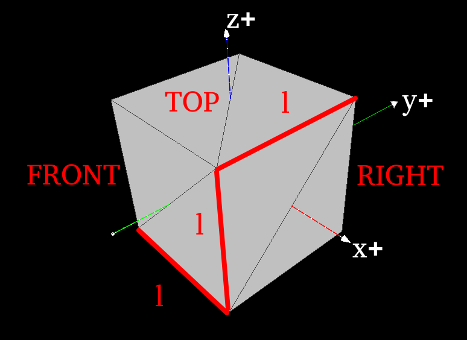
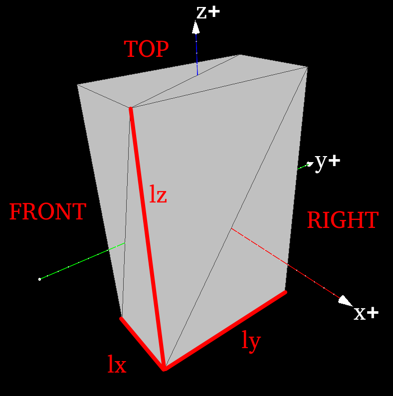
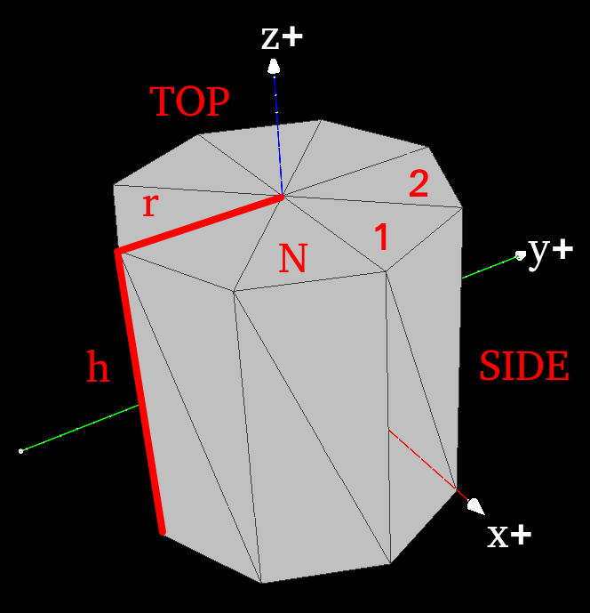
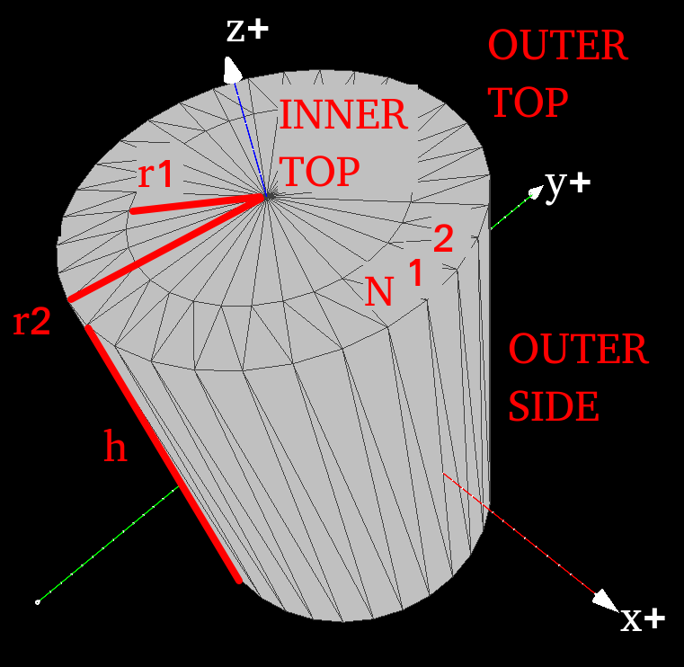

# gen_stl

Simple surface generator. Written for LIGGGHTS.

## Compilation

```bash
make
```

## Usage

```bash
gen_stl <shape> <params>
```

### cube

Generates an axis-aligned cube centered at (0, 0, 0).



+ l - length of a side
+ mask - sides to generate
    + 1 - TOP ( z+ )
    + 2 - BOTTOM ( z- )
    + 4 - FRONT ( y- )
    + 8 - BACK ( y+ )
    + 16 - LEFT ( x- )
    + 32 - RIGHT ( x+ )

Mask can be applied by adding the values together.

### box

Generates an axis-aligned box centered at (0, 0, 0).



+ lx - length of the X side
+ ly - length of the Y side
+ lz - length of the Z side
+ mask - sides to generate
    + 1 - TOP ( z+ )
    + 2 - BOTTOM ( z- )
    + 4 - FRONT ( y- )
    + 8 - BACK ( y+ )
    + 16 - LEFT ( x- )
    + 32 - RIGHT ( x+ )

Mask can be applied by adding the values together.

### cylinder

Generates an axis-aligned cylinder centered at (0, 0, 0).



+ r - radius
+ h - height
+ N - number of segments
+ mask - sides to generate
    + 1 - TOP ( z+ )
    + 2 - BOTTOM ( z- )
    + 4 - SIDE

Mask can be applied by adding the values together.

### pipe

Generates an axis-aligned pipe centered at (0, 0, 0).



+ r1 - inner radius
+ r2 - outer radius
+ h - height
+ N - number of segments
+ mask - sides to generate
    + 1 - INNER_TOP ( r1, z+ )
    + 2 - OUTER_TOP ( r2, z+ )
    + 4 - INNER_BOTTOM ( r1, z- )
    + 8 - OUTER_BOTTOM ( r2, z- )
    + 16 - INNER_SIDE ( r1 )
    + 32 - OUTER_SIDE ( r2 )

Mask can be applied by adding the values together.

### disk

Generates an axis-aligned disk centered at (0, 0, 0).

+ r - radius
+ N - number of segments

## Examples

Creating a unit cube:

```bash
gen_stl cube 1 63 > cube.stl
```

Generating a disk in LIGGGHTS at (0, 0, 0):

```bash
variable    deviceRadius    equal   0.1
variable    deviceHeight    equal   0.4
variable    deviceHeight05  equal   ${deviceHeight}*0.5
variable    bottomModel     string  bottom.stl
shell       ../utils/gen_stl cylinder ${deviceRadius} ${deviceHeight} 32 1 > ${bottomModel}
fix         bottomMesh all mesh/surface file ${bottomModel} type 1 move 0 0 -${deviceHeight05}
```
